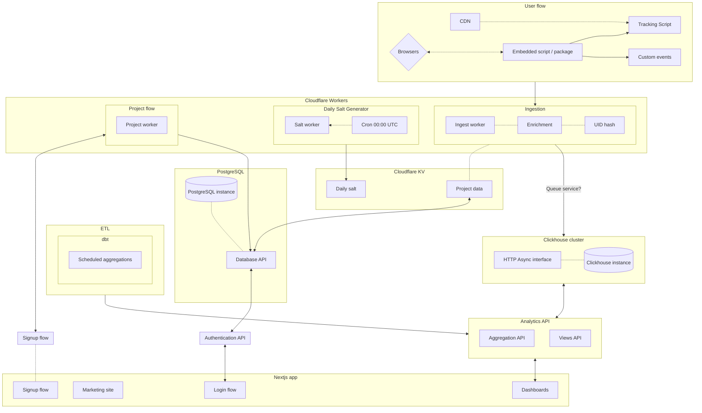

```mermaid
flowchart
    subgraph user[User flow]
        CDN -...-> script
        Browser{Browsers} <-..-> package[Embedded script / package]
        ---> script[Tracking Script] & events[Custom events]
    end

    subgraph kv[Cloudflare KV]
        salt[Daily salt]
        project[Project data]
    end

    subgraph clickhouse[Clickhouse cluster]
        async[HTTP Async interface] -.- db[(Clickhouse instance)]
    end

    subgraph workers[Cloudflare Workers]
        subgraph ingestion[Ingestion]
            ingest[Ingest worker] -.-
            enrich[Enrichment] -.-
            uid[UID hash]
        end
        ingestion -.- project

        subgraph saltgen[Daily Salt Generator]
            direction RL
            cron[Cron 00:00 UTC] .-> saltworker[Salt worker]
        end
        saltgen --> salt

        subgraph projectflow[Project flow]
            direction TB
            projectworker[Project worker]
        end
    end

    user --> ingestion
    ingestion --> |Queue service?| clickhouse

    subgraph etl[ETL]
        subgraph dbt
            aggregation[Scheduled aggregations]
        end
    end

    subgraph api[Analytics API]
        direction TB
        aggr[Aggregation API]
        views[Views API]
    end

    subgraph next[Nextjs app]
        dashboard[Dashboards]
        marketing[Marketing site]
        login[Login flow]
        signup[Signup flow]
    end

    etl --> api
    clickhouse <--> api
    api <--> dashboard

    subgraph signupflow[Signup flow]
    end

    subgraph postgresql[PostgreSQL]
        database[(PostgreSQL instance)] -.-
        dbapi[Database API]
    end

    projectflow <--> signupflow
    projectflow --> dbapi
    project <--> dbapi
    signupflow -.- signup

    subgraph auth[Authentication API]
    end

    dbapi <--> auth
    auth <--> login
```
