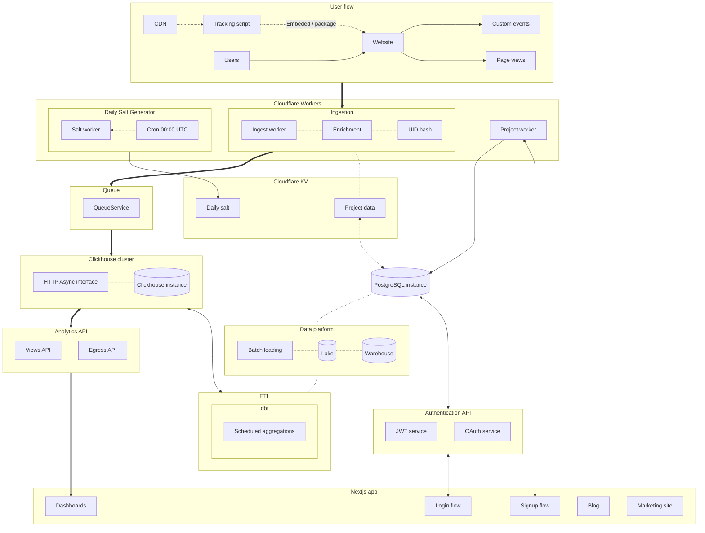

# Design principles

A yet-to-be-named web analytics solution.

### Main design principles:

- Privacy friendly, no-cookies approach
- Fast & lightweight
- Simple, no useless bloat
  - Focus on features that deliver actual value

Performance and UX are the main drivers.

### Cookieless tracking

Privacy is important but so is data-driven decision making for your product.
We can respect a users privacy by distincting users not by identifying but by calculating a hash based on requests made to the collector.
Using information about a user's IP, user-agent, the website they are visting and a random salt, we can make distinctions between users for aggregation but not identify them.

The salt is changed daily to prevent tracking users accross days. Information about the website itself (projectid) is used to prevent tracking between sites.

This approach has it's downsides but I think making a compromise between good enough data and good UX is important.

## Architecture overview

### Overview

The project can be split into 4 major components: tracking, collection, OLAP database and aggregation. In addition layers for actual end users like an analytics API and user dashboard are needed. All of the major components work independently of each other following microservice architecture. This allows for switching component design to address issues and bottlenecks can be done efficiently.

#### Tracking

Tracking is acomplished with a script either injected into a website using a ready made package or directly embeded. The script automatically tracks pageviews. More features such as tracking file downloads and link clicks could be added, but need to be weighted against performance vs. value provided. The script relies on navigator.sendBeacon for sending asyncronous post requests to not hinder performance.

To track custom events using a package is required. Events are collected in a separate endpoint. Event dimensions and their values can be arbitary.

#### Collection

While the main architecture is based on a serverless design, it is not required. Please see the baseline ExpressJS based base-collector.
